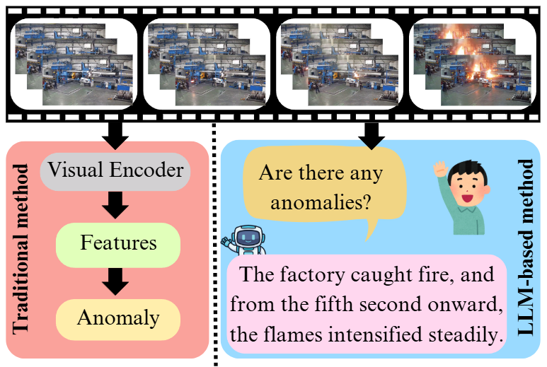
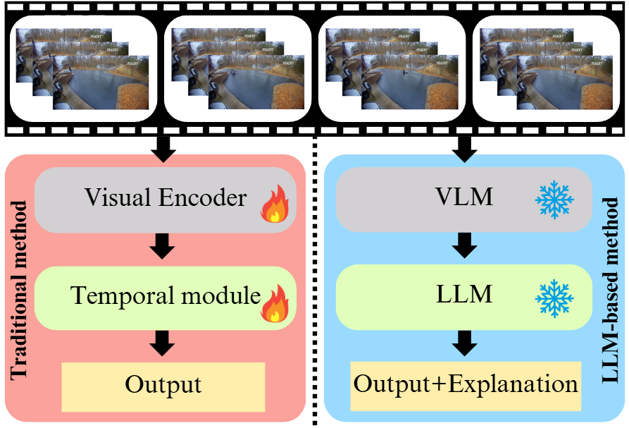
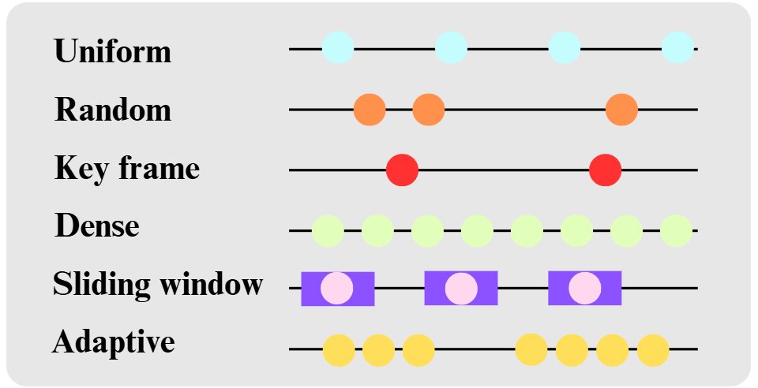

# VAD-LLM

### 🔥🔥🔥[Quo Vadis, Anomaly Detection? LLMs and VLMs in the Spotlight](https://arxiv.org/abs/2412.18298)💡

---
👋👋👋 A collection of papers and resources related to Large Language Models in video anomaly detection🚨. 
>
> More details please refer to our [paper](https://arxiv.org/abs/2412.18298). 
>
> Please let us know if you find out a mistake or have any suggestions by e-mail: Xi.Ding1@anu.edu.au
>
> If you find our work useful for your research, please cite the following:
```
@misc{ding2024quovadisanomalydetection,
      title={Quo Vadis, Anomaly Detection? LLMs and VLMs in the Spotlight}, 
      author={Xi Ding and Lei Wang},
      year={2024},
      eprint={2412.18298},
      archivePrefix={arXiv},
      primaryClass={cs.CV},
      url={https://arxiv.org/abs/2412.18298}, 
}
```
---
## 🚀 News
- \[26/12/2024\] Release GitHub for our paper🎁.
- \[25/12/2024\] Release our paper in arXiv🎄.

## 
<table>
  <tr>
    <td style="text-align: center;">
      <br>(a) Temporal modeling
    </td>
    <td style="text-align: center;">
      <br>(b) Interpretability
    </td>
  </tr>
  <tr>
    <td style="text-align: center;">
      <br>(c) Training-free
    </td>
    <td style="text-align: center;">
      <br>(d) Open-world
    </td>
  </tr>
</table>


We present a systematic evaluation of 13 closely related works from 2024 that use large language models (LLMs) and vision-language models (VLMs) for video anomaly detection (VAD). The analysis is organized around four key perspectives: (a) temporal modeling, (b) interpretability, (c) training-free, and (d) open-world detection, each represented by a subfigure. For each perspective, we highlight the strategies used, key strengths, limitations, and outline promising directions for future research. The video frames used in the analysis are sourced from the [MSAD](https://msad-dataset.github.io/) dataset.


## Comparison of recent methods in video anomaly detection (VAD)
We compare recent approaches in VAD, highlighting key aspects such as interpretability, temporal modeling, few-shot learning, and open-world detection. Performance
is evaluated across six benchmark datasets: UCSD Ped2 (Ped2), CUHK Avenue (CUHK), ShanghaiTech (ShT), UCF-Crime (UCF), XD-Violence (XD), and UBnormal (UB). Datasets evaluated using Area Under the Curve (AUC) include Ped2, CUHK, ShT, UCF, and UB, while the XD dataset is evaluated using Average Precision (AP).
| Method            | LLM/VLM           | Interpret. | Temporal |    Few-shot   |    Open-world     | [Ped2](http://www.svcl.ucsd.edu/projects/anomaly/dataset.htm)   | [CUHK](https://www.cse.cuhk.edu.hk/leojia/projects/detectabnormal/dataset.html)   | [ShT](https://github.com/desenzhou/ShanghaiTechDataset)    | [UCF](https://www.crcv.ucf.edu/research/real-world-anomaly-detection-in-surveillance-videos/)    | [XD](https://roc-ng.github.io/XD-Violence/)     | [UB](https://github.com/lilygeorgescu/UBnormal/)     |
|--------------------|-------------------|------------|----------|----------|------------|--------|--------|--------|--------|--------|--------|
| [VLAVAD](https://arxiv.org/abs/2409.14109)       | Fine-tuning       | ✅        | ✅        |          |            | 99.0   | 87.6   | 87.2   | --     | --     | --     |
| [VADor](https://arxiv.org/abs/2401.05702)        | Fine-tuning       | ✅        | ✅        |          |            | --     | --     | --     | 88.1   | --     | --     |
| [OVVAD](https://arxiv.org/abs/2311.07042)        | Fine-tuning       |          | ✅        |          | ✅          | --     | --     | --     | 86.4   | 66.5   | 62.9   |
| [LAVAD](https://arxiv.org/abs/2404.01014)        | Training-free     | ✅       | ✅        | ✅        |            | --     | --     | --     | 80.3   | 62.0   | --     |
| [TPWNG](https://arxiv.org/abs/2404.08531)        | Fine-tuning       |            |✅        |          |            | --     | --     | --     | 87.8   | 83.7   | --     |
| [Holmes-VAD](https://arxiv.org/abs/2406.12235)   | Fine-tuning       |✅         | ✅        |          |            | --     | --     | --     | 89.5   | 90.7   | --     |
| [AnomalyRuler](https://arxiv.org/abs/2407.10299) | Fine-tuning       |            |          | ✅        |            | 97.9   | 89.7   | 85.2   | --     | --     | 71.9   |
| [STPrompt](https://arxiv.org/abs/2408.05905)     | Fine-tuning       |✅         | ✅        |          |            | --     | --     | 97.8   | 88.1   | --     | 64.0   |
| [Holmes-VAU](https://arxiv.org/abs/2412.06171)   | Fine-tuning       |          | ✅        |          | ✅          | --     | --     | --     | 89.0   | 87.7   | --     |
| [VERA](https://arxiv.org/abs/2412.01095)         | Training-free     | ✅        |          |          |            | --     | --     | --     | 86.6   | 88.2   | --     |


## Comparison of Different Sampling Strategies for Temporal Reasoning

### Sampling Strategies Illustration


### Sampling Strategies Table

| Sampling         | Interval   | Frame Count  | Redundancy | Target Use Case          | Cost     |
|-------------------|------------|--------------|------------|--------------------------|----------|
| Uniform           | Fixed      | Medium       | Medium     | Global trend             | High     |
| Random            | Random     | Medium       | Low        | Data augmentation        | High     |
| Key frame         | Adaptive   | Low to Med.  | Low        | Key event extraction     | Medium   |
| Dense             | One        | High         | High       | Fine-grained modeling    | Low      |
| Sliding window    | Adaptive   | Medium       | Medium     | Local temporal details   | Medium   |
| Adaptive          | Dynamic    | High         | Low        | Comprehensive modeling   | Medium   |


